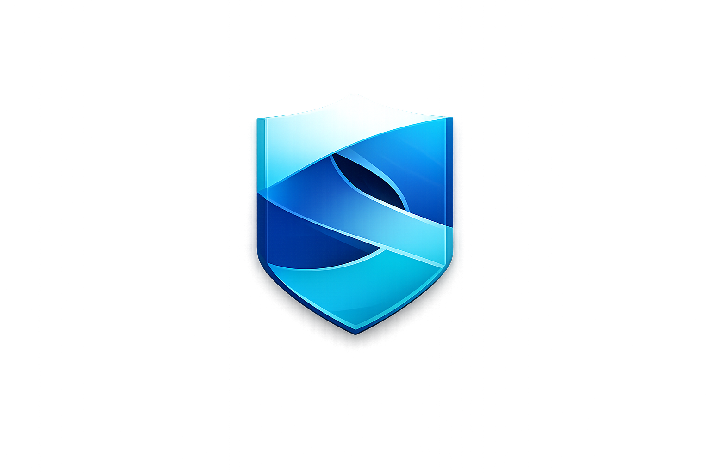

<!-- =========================================================
 SystemONE · README (Web-Style)
 Hinweis: GitHub rendert HTML in README, aber ohne eigenes CSS/JS.
 Das Layout unten nutzt HTML + Tabellen + Details-Blöcke, damit es
 "wie eine Webseite" wirkt – sauber, modern, und gut lesbar.
========================================================= -->

<p align="right">
  
</p>

<h1>SystemONE</h1>

<p>
  <b>SystemONE</b> ist ein <b>lokales Smart-System-Dashboard</b> im <b>Digital-Dark Design</b>:
  eine zentrale Oberfläche, die <b>Smart Home (Home Assistant)</b>, <b>NAS/Files</b>,
  <b>KI-Agent (PEET)</b> und Tools wie <b>3D Creator / Gridfinity Generator</b> in <b>einem</b> System bündelt.
</p>

<hr/>

<table width="100%">
  <tr>
    <td width="33%" valign="top">
      <h3>⚙️ Was es ist</h3>
      <ul>
        <li>Ein zentrales Dashboard für dein komplettes Smart-System</li>
        <li>Lokaler Betrieb (privacy-first), modular, Docker-first</li>
        <li>UI-Standard: <b>Digital-Dark</b> + <b>SystemONE Logo oben rechts</b></li>
      </ul>
    </td>
    <td width="33%" valign="top">
      <h3>🧠 Kernfunktionen</h3>
      <ul>
        <li><b>PEET</b>: Chat, Automationen, Wissenssuche über Dokumente</li>
        <li><b>Home Assistant</b>: Geräte, Räume, Szenen, Sensoren (auch KI-triggerbar)</li>
        <li><b>NAS/Files</b>: Zugriff, Suche, Sortierung, Workflows</li>
      </ul>
    </td>
    <td width="33%" valign="top">
      <h3>🧩 Tools</h3>
      <ul>
        <li><b>3D Creator</b>: Objekte live ansehen & verwalten</li>
        <li><b>Gridfinity Generator</b>: Parameter → Preview → Export → Presets</li>
        <li>Optional später: Slicer / Direktdruck-Workflow</li>
      </ul>
    </td>
  </tr>
</table>

<hr/>

<h2>✨ Highlights</h2>

<ul>
  <li><b>Digital-Dark Dashboard UI</b> (dark, modern, klar strukturiert)</li>
  <li><b>SystemONE Logo oben rechts</b> (fix im Header integriert)</li>
  <li><b>PEET Agent</b>: Chat + Automationen + Wissenssuche</li>
  <li><b>Home Assistant Steuerung</b>: Geräte, Szenen, Sensoren (inkl. KI-triggerbar)</li>
  <li><b>NAS / File Hub</b>: Zugriff, Suche, Sortierung (SmartSortier-Logik möglich)</li>
  <li><b>3D Bereich</b>: 3D-Objekte live ansehen & verwalten</li>
  <li><b>Gridfinity Generator</b>: Parameter → Vorschau → Export → Presets</li>
  <li><b>Docker-first</b>: modulare Services, sauber getrennte Komponenten</li>
</ul>

<hr/>

<h2>🧱 Module</h2>

<details open>
  <summary><b>1) Dashboard (Frontend)</b></summary>
  <br/>
  <ul>
    <li>Startseite mit <b>Karten / Panels</b></li>
    <li>Navigation zu: <b>Chat</b>, <b>SmartHome</b>, <b>NAS</b>, <b>3D</b>, <b>Generator</b>, <b>Settings</b></li>
    <li>Fokus: schnelle Übersicht + klare Interaktion (ohne UI-Overkill)</li>
    <li><b>Top-Header mit SystemONE Logo oben rechts (fix)</b></li>
  </ul>
</details>

<details open>
  <summary><b>2) PEET (KI-Agent)</b></summary>
  <br/>
  <ul>
    <li>Chat UI (Kontext + Verlauf)</li>
    <li>Dokumentenfragen (RAG / Vektorsuche optional)</li>
    <li>Aktionen ausführen (z. B. Licht schalten, Datei sortieren, Preset speichern)</li>
  </ul>
</details>

<details open>
  <summary><b>3) SmartHome (Home Assistant)</b></summary>
  <br/>
  <ul>
    <li>Geräte-Listen, Räume, Favoriten</li>
    <li>Sensor-Status, Automations-Trigger</li>
    <li>API-Anbindung (REST/WebSocket – je nach Setup)</li>
  </ul>
</details>

<details open>
  <summary><b>4) NAS / Files</b></summary>
  <br/>
  <ul>
    <li>Browse / Search</li>
    <li>Upload / Download (optional)</li>
    <li>Workflows: erkennen → klassifizieren → umbenennen → ablegen</li>
  </ul>
</details>

<details open>
  <summary><b>5) 3D / Creator</b></summary>
  <br/>
  <ul>
    <li>Live Preview von 3D-Objekten (Browser/Three.js oder Desktop)</li>
    <li>Bibliothek / Projekte / Export</li>
    <li>Optional: Slicer-Integration / Direktdruck-Workflow (später)</li>
  </ul>
</details>

<details open>
  <summary><b>6) Gridfinity Generator</b></summary>
  <br/>
  <ul>
    <li>Parameter UI (Units, Wall, Raster, etc.)</li>
    <li>Vorschau / Preview</li>
    <li>STL Export</li>
    <li>Presets (localStorage / DB)</li>
  </ul>
</details>

<hr/>

<h2>🧠 Architektur (Kurz)</h2>

<p>
  <b>Frontend</b> → <b>API</b> → (SmartHome / NAS / KI / Generator)
</p>

<ul>
  <li><b>Frontend</b>: Angular (oder Web UI)</li>
  <li><b>API</b>: FastAPI / Node / Gateway (je nach Build)</li>
  <li><b>KI</b>: Ollama / lokale Modelle + optional Vector DB (z. B. Qdrant)</li>
  <li><b>Daten</b>: Postgres (optional), Redis (optional), Filesystem/NAS</li>
</ul>

<hr/>

<h2>🎨 Design-Standard (Digital-Dark)</h2>

<ul>
  <li>Dunkler Hintergrund, <b>runde Cards</b>, klare Kontraste</li>
  <li>Wenige Akzentfarben (z. B. Blau/Orange je nach Theme)</li>
  <li><b>Links Navigation</b>, <b>Center Content</b>, optional <b>Right Panel</b></li>
  <li>Icons sparsam (nur wo funktional notwendig)</li>
  <li>Fokus auf <b>Lesbarkeit</b> + <b>klare Hierarchie</b></li>
  <li><b>Fixer Header mit SystemONE Logo oben rechts</b></li>
</ul>

<hr/>

<h2>🗂️ Repository Struktur (Empfehlung)</h2>

```txt
SystemONE/
  frontend/            # UI (Angular / Web)
  api/                 # Backend API (FastAPI/Node)
  services/
    peet/              # Agent / RAG / Tools
    smarthome/         # HA Adapter / Clients
    files/             # NAS + SmartSortier
    gridfinity/        # Generator + Presets
    creator3d/         # 3D Viewer/Renderer
  infra/
    docker-compose.yml # gesamter Stack
    nginx/             # optional Reverse Proxy
  docs/                # Doku, Screens, Entscheidungen

<hr/>


<h2>🚀 Getting Started</h2>


<blockquote>
  Wird ergänzt, sobald <code>docker-compose.yml</code> + erste Module im Repo sind.
</blockquote>


<ol>
  <li>Repository klonen</li>
  <li><code>infra/docker-compose.yml</code> starten</li>
  <li>Frontend öffnen (Nginx/Dev-Server)</li>
  <li>Home Assistant / NAS / PEET verbinden</li>
</ol>


<hr/>


<h2>🛣️ Roadmap</h2>


<ul>
  <li>[ ] Basis Dashboard + Navigation (Digital-Dark)</li>
  <li>[ ] Header inkl. SystemONE Logo oben rechts</li>
  <li>[ ] PEET Chat (lokal) + Tool-Calls</li>
  <li>[ ] Home Assistant Anbindung + Geräte-UI</li>
  <li>[ ] NAS Hub + Suche</li>
  <li>[ ] Gridfinity Generator V1 (Preview + STL Export)</li>
  <li>[ ] 3D Live Preview + Objektbibliothek</li>
  <li>[ ] Presets + Profile Auswahl beim Start</li>
</ul>


<hr/>


<h2>📄 License</h2>


<p>TBD (z. B. MIT / Private)</p>


<hr/>


<h2>🤝 Credits</h2>


<p>Built by <b>Pipercat</b>.</p>
