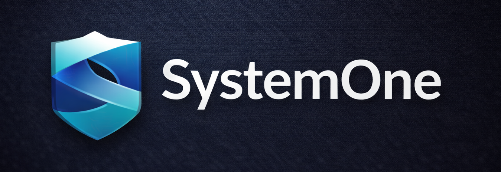

<p align="center">
  
</p>


SystemONE ist ein **lokales Smart-System-Dashboard** im **Digital-Dark Design**.  
Es vereint **Smart Home**, **NAS**, **KI (PEET)** und **3D-Tools** in einer zentralen Plattform.

---

## ✨ Features

- Modernes **Digital-Dark Dashboard**
- SystemONE Logo fest im Header
- KI-Agent **PEET** (Chat, Automationen, Wissenssuche)
- Home Assistant Integration
- Zentrales Datei- und NAS-Management
- 3D Viewer & Creator Tools
- Gridfinity Generator mit Presets
- Docker-basierte Architektur

---

## 📦 Module

### Dashboard
- Zentrale Startseite mit Übersicht
- Navigation zu allen Bereichen
- Fokus auf Performance & Übersichtlichkeit

### PEET (KI-Agent)
- Kontextbasierter Chat
- Dokumentenanalyse (RAG optional)
- Steuerung von Systemfunktionen

### SmartHome
- Geräteverwaltung
- Räume & Szenen
- Sensor-Monitoring
- API-Anbindung an Home Assistant

### SmartSortierer Pro (Files / NAS)
- **Intelligente Dokumentenverwaltung** mit KI
- Automatische Upload-Verarbeitung & Duplikat-Erkennung
- KI-basierte Klassifikation (Ollama LLM)
- Vector-Search & RAG für Dokumenten-Chat
- Strukturierte Archivierung (Inbox → Ingested → Sorted → Archive)
- Background-Jobs für Extract, Chunk, Embed
- API mit Security & Audit-Logging
- Integration mit PEET für intelligente Dokumentensuche

### 3D / Creator
- 3D-Vorschau im Browser
- Projektverwaltung
- Export-Funktionen

### Gridfinity Generator
- Parametereingabe
- Live-Vorschau
- STL-Export
- Preset-System

---

## 🧠 Architektur

Frontend → API → Services
├─ SmartHome
├─ SmartSortierer (Files/NAS mit KI)
│  ├─ API (FastAPI)
│  ├─ Worker (Background Jobs)
│  └─ Frontend (Angular)
├─ PEET
├─ Generator
└─ 3D Viewer

**Technologien:**

- Frontend: Angular / Web UI
- Backend: FastAPI / Node.js
- KI: Ollama (lokal) - für PEET & SmartSortierer
- Daten: PostgreSQL / Redis
- Vector-DB: Qdrant (für RAG)
- Storage: NAS / Filesystem

---

## 🎨 Design

- Dark Mode als Standard
- Runde Cards
- Klare Kontraste
- Reduziertes Icon-Set
- Fokus auf Lesbarkeit
- Fixer Header mit Logo

---

## 📁 Projektstruktur

```
SystemONE/
├── services/
│   └── smartsortierer/
│       ├── api/              # FastAPI Backend
│       ├── worker/           # Background Jobs
│       └── frontend/         # Angular UI
├── infra/
│   ├── docker-compose.yml    # Docker Stack
│   ├── nginx/                # Reverse Proxy
│   └── scripts/              # Setup & Deploy
├── docs/
│   └── smartsortierer/       # Dokumentation
├── Generator_3/              # Gridfinity Generator
└── Backup/                   # Legacy Code
```

---

## 🚀 Installation

### Voraussetzungen
- Docker & Docker Compose
- Min. 8GB RAM
- 20GB freier Speicher

### Setup

1. **Repository klonen**
```bash
git clone https://github.com/Pipercat/SystemONE.git
cd SystemONE
```

2. **Umgebung konfigurieren**
```bash
cp .env.example .env
nano .env  # API Keys, Passwörter, Storage-Pfad anpassen
```

3. **Docker Stack starten**
```bash
cd infra
docker compose up -d --build
```

4. **Ollama Modelle laden**
```bash
docker compose exec ollama ollama pull llama3.2:3b
docker compose exec ollama ollama pull nomic-embed-text
```

5. **Weboberfläche öffnen**
- Dashboard: `http://localhost`
- API Docs: `http://localhost/api/docs`
- SmartSortierer API: `http://localhost/api/docs`

### Erste Schritte

**Datei hochladen:**
```bash
curl -X POST -F "file=@test.pdf" \
  -H "x-ss-api-key: your-api-key" \
  http://localhost/api/files/upload?path=00_inbox
```

**Verarbeitung starten:**
Die Datei wird automatisch durch Worker verarbeitet (Extract → Chunk → Embed → Classify)

**Status prüfen:**
```bash
curl -H "x-ss-api-key: your-api-key" \
  http://localhost/api/docs/list
```

---

## 🛣️ Roadmap

### SmartSortierer (Files/NAS)
- [x] Core API (FastAPI)
- [x] Upload & Duplikat-Erkennung
- [x] Worker-System (Redis Queue)
- [x] Extract, Chunk, Embed Pipeline
- [x] PostgreSQL Schema (11 Tabellen)
- [x] Qdrant Vector-Storage
- [ ] Klassifikation & Review UI
- [ ] RAG-Chat Interface
- [ ] Angular Frontend

### Weitere Module
- [ ] Dashboard Basis
- [ ] PEET Integration (KI-Agent)
- [ ] Home Assistant Connector
- [ ] Gridfinity Generator Integration
- [ ] 3D Preview & Creator
- [ ] Profil-System
- [ ] Backup & Restore

### Status
**Phase 0-5 abgeschlossen** (SmartSortierer Core)  
Details: [services/smartsortierer/README.md](services/smartsortierer/README.md)

---

## 📄 Lizenz

TBD (MIT / Private)

---

## 🤝 Credits

Built by **Pipercat**.


⸻